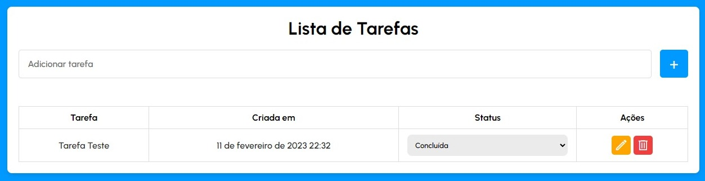

# Lista de Tarefas

## O projeto consiste em uma aplicação Full Stack completa com o objetivo de auxiliar no gerenciamento de atividades e tarefas.

<br>
 

<br>
<br>
 
# Tecnologias Usadas

## Backend


- <a href="https://nodejs.org/en/"> NodeJS</a>
- <a href="https://expressjs.com/">Express</a>

## Frontend

- <a href="https://www.w3schools.com/html/">HTML</a>

- <a href="https://www.w3schools.com/css/">CSS</a>

- <a href="https://www.javascript.com/">JavaScript</a>

## Database

- <a href="https://www.mysql.com/">MySQL</a>

<br>

# Como Rodar

### Baixe ou clone este repositório, após isso sera necessário criar um banco de dados MySQL junto com as colunas necessárias.

```bash
#Command to create a database in the MySQL terminal:

$ CREATE DATABASE database_name;
```

### Em seguida, é necessário criar a tabela de "tarefas" que será utilizada pelo aplicativo.


```bash
#Command to create the table with its columns

$ CREATE TABLE tasks(
    id INT PRIMARY KEY AUTO_INCREMENT,
    title VARCHAR(45) NOT NULL,
    status VARCHAR(45) NOT NULL,
    created_at VARCHAR(45) NOT NULL
);
```

### Na raiz do projeto há um arquivo chamado ".env.example" este arquivo contém 5 campos que terão que ser preenchidos em um arquivo chamado ".env", basta criar este arquivo ou renomear o arquivo de exemplo. Depois disso, basta preencher os campos com os dados relacionados ao seu banco de dados.

```bash
PORT= [Porta que seu server vai rodar]
MYSQL_HOST= [Host da sua máquina, por padrão é 'localhost']
MYSQL_USER= [Usuário, MySQL por padrão usa o 'root']
MYSQL_PASSWORD= [Senha escolhida na instalação d MySQL]
MYSQL_DB= [Nome d banco de dados criado.]
```

### Após isso, instale o node_modules com npm install e de um npm start.

<br>


